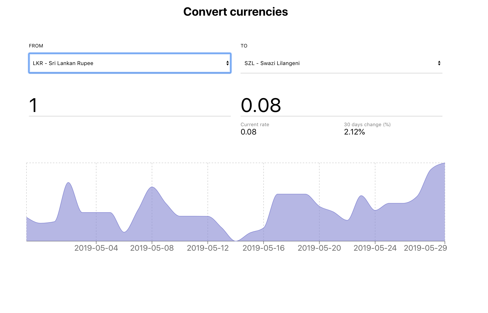

# fixer-currency-converter
A basic currency converter in ReactJs using the fixer.io api.

## Screenshots


## Dependencies:
#### Recharts:
Is used in this project to plot plotting the evolution of the converted value over the past 30 days. The library is well used, 15k+ "used" and 11k+ "stars" on github. http://recharts.org/en-US/

#### Axios:
Is used in this project to make http request to fixer.io's api. The library supports the Promise API and default hanles data in the JSON format. https://github.com/axios/axios

## Usage
```
$ git clone https://github.com/huttunenMarco/fixer-currency-converter.git
$ cd fixer-currency-converter
$ npm install
$ npm start
// will start running at port :3000
```
